[](https://travis-ci.org/ksator/junos-automation-with-AWX) 


## Documentation structure
[**About AWX**](README.md#about-awx)  
[**About this repo**](README.md#about-this-repo)  
[**How to use this repo**](README.md#how-to-use-this-repo)    
[**AWX Installation**](README.md#awx-installation)  
[**Install the requirements to use Ansible modules for Junos**](README.md#install-the-requirements-to-use-ansible-modules-for-junos)  
[**Add the Juniper.junos role**](README.md#add-the-juniperjunos-role)  
[**Install the requirements to use the automation content hosted in this repository**](README.md#install-the-requirements-to-use-the-automation-content-hosted-in-this-repository)   
[**Clone this repository**](README.md#clone-this-repository)  
[**Define your variables**](README.md#define-your-variables)  
[**Configure AWX with automation**](README.md#configure-awx-with-automation)  
[**Consume AWX templates with automation**](README.md#consume-awx-templates-with-automation)  
[**Delete AWX templates with automation**](README.md#delete-awx-templates-with-automation)  
[**AWX CLI**](README.md#awx-cli)  
[**Continuous integration with Travis CI**](README.md#continuous-integration-with-travis-ci)  
[**Looking for more Junos automation solutions**](README.md#looking-for-more-junos-automation-solutions)  

## About AWX

AWX is Ansible Tower open sourced.  
You can use it if you want to consume your ansible playbooks with:
- GUI
- REST API
- users authentication and permissions. 

Here's the [**AWX FAQ**](https://www.ansible.com/products/awx-project/faq)  
Here's the [**AWX REST API guide**](http://docs.ansible.com/ansible-tower/2.3.0/html/towerapi/index.html)  

## About this repo  

This repository provides the instructions to add the AWX requirements for Junos automation.  
 - This repository doesn’t install AWX. You still need to install AWX yourself. 
 
This repository has automation content to:
- configure an existing AWX setup 
    - If you want to consume Ansible content using AWX, you can use this repository to quickly add it to AWX.  
- to consume AWX
    - you can use this repository to execute playbooks with REST calls.    


## How to use this repo 

The steps are:  
- Install AWX. This repository doesn’t install AWX. You still need to install AWX yourself.  
- Install the requirements to use Ansible modules for Junos  
- Add the Juniper.junos role from Galaxy to AWX
- Install the requirements to use the python scripts hosted in this repository  
- Clone this repository
- Edit the file [**variables.yml**](variables.yml) to indicate your details such as the ip address of your AWX, the git repository that has the playbooks you want to add yo your AWX, ....
- Execute the script [**configure_awx.py**](configure_awx.py): It uses the variables you defined in the file [**variables.yml**](variables.yml) to configure AWX    
- You can now consume your playbooks with AWX GUI and AWX API!
   - AWX GUI is ```http://<awx_ip_address>```    
   - You can visit the AWX REST API with a web browser: ```http://<awx_ip_address>/api/v2/``` 
   - Execute the file [**run_awx_template.py**](run_awx_template.py) to consume your playbooks from AWX REST API. 

## AWX installation 

This repository doesn’t install AWX. You still need to install AWX yourself.  
Here's the [**install guide**](https://github.com/ansible/awx/blob/devel/INSTALL.md)  
I am running AWX as a containerized application.  

By default, AWX pulls the latest tag from docker hub.  
Here's how to use another tag. You need to do this before installing the AWX 
```
$ nano awx/installer/inventory 
```
```
$ more awx/installer/inventory | grep dockerhub_version
dockerhub_version=1.0.1
```

By default, AWX database is lost with reboots. You can change this behavior when you install AWX if you prefer AWX to keep its database after system restarts.  

Issue the ```docker ps``` command to see what containers are running.  
```
# docker ps
CONTAINER ID        IMAGE                     COMMAND                  CREATED             STATUS              PORTS                                NAMES
5f506acf7a9a        ansible/awx_task:latest   "/tini -- /bin/sh -c…"   2 weeks ago         Up About a minute   8052/tcp                             awx_task
89d2b50cd396        ansible/awx_web:latest    "/tini -- /bin/sh -c…"   2 weeks ago         Up About a minute   0.0.0.0:80->8052/tcp                 awx_web
6677b05c3dd8        memcached:alpine          "docker-entrypoint.s…"   2 weeks ago         Up About a minute   11211/tcp                            memcached
702d9538c538        rabbitmq:3                "docker-entrypoint.s…"   2 weeks ago         Up About a minute   4369/tcp, 5671-5672/tcp, 25672/tcp   rabbitmq
7167f4a3748e        postgres:9.6              "docker-entrypoint.s…"   2 weeks ago         Up About a minute   5432/tcp                             postgres
```
You can start/stop AWX using these commands: 
```
$ docker stop awx_task awx_web memcached rabbitmq postgres
awx_task
awx_web
memcached
rabbitmq
postgres
```
```
$ docker ps
CONTAINER ID        IMAGE               COMMAND             CREATED             STATUS              PORTS               NAMES
```
```
$ docker start memcached rabbitmq postgres awx_web awx_task 
memcached
rabbitmq
postgres
awx_web
awx_task
```
```
$ docker ps
CONTAINER ID        IMAGE                     COMMAND                  CREATED             STATUS              PORTS                                NAMES
5f506acf7a9a        ansible/awx_task:latest   "/tini -- /bin/sh -c…"   2 weeks ago         Up 1 second         8052/tcp                             awx_task
89d2b50cd396        ansible/awx_web:latest    "/tini -- /bin/sh -c…"   2 weeks ago         Up 1 second         0.0.0.0:80->8052/tcp                 awx_web
6677b05c3dd8        memcached:alpine          "docker-entrypoint.s…"   2 weeks ago         Up 3 seconds        11211/tcp                            memcached
702d9538c538        rabbitmq:3                "docker-entrypoint.s…"   2 weeks ago         Up 2 seconds        4369/tcp, 5671-5672/tcp, 25672/tcp   rabbitmq
7167f4a3748e        postgres:9.6              "docker-entrypoint.s…"   2 weeks ago         Up 2 seconds        5432/tcp                             postgres
```

The default AWX credentials are admin/password.  


## install the requirements to use Ansible modules for Junos  

AWX natively includes [**modules for Junos**](http://docs.ansible.com/ansible/latest/list_of_network_modules.html#junos)

We need to install the requirements to use the Ansible modules for Junos in the ```awx_task``` container.


From the server that hosts the AWX containers, run this command to connect to the ```awx_task``` container cli:
```
docker exec -it awx_task bash  
```
Once connected, run these commands from the awx_task container to install the requirements:
```
yum install -y pip python-devel libxml2-devel libxslt-devel gcc openssl libffi-devel python-pip  
pip install --upgrade pip
pip install junos-eznc jxmlease jsnapy
```
Once complete, exit the container.
```
exit
```


Alternatively, you can run this command on the server that hosts the AWX containers to install jsnapy jxmlease junos-eznc in awx_task container: 
```
docker exec -it awx_task pip install jsnapy jxmlease junos-eznc
```   
This is the equivalent of running this:
```
docker exec -it awx_task bash  
pip install junos-eznc jxmlease jsnapy
exit
```


## Add the Juniper.junos role

In addition to the [**ansible modules for Junos**](http://docs.ansible.com/ansible/latest/list_of_network_modules.html#junos) shipped with AWX, there is also another modules library you can use to interact with Junos.  
These modules are available in the ```Juniper.junos``` role on [**galaxy**](https://galaxy.ansible.com/Juniper/junos/)  
These modules are not shipped with Ansible. 
These two sets of modules for Junos automation can coexist on the same Ansible control machine.  

Run these commands from ```awx_task``` container to download and install the ```Juniper.junos``` role from [**galaxy**](https://galaxy.ansible.com/Juniper/junos/)

Connect to the container cli:
```
docker exec -it awx_task bash  
```

Once connected ```awx_task``` container, run these commands:
```
# more ansible.cfg 
[defaults]
roles_path = /etc/ansible/roles:./
```
```
# ansible-galaxy install Juniper.junos,1.4.3
```
```
# ansible-galaxy list
- Juniper.junos, 1.4.3
```
```
# ls /etc/ansible/roles/
Juniper.junos
```
Once complete, exit the container.  
```
# exit
```

Here's the Juniper.junos role documentation: 
- http://junos-ansible-modules.readthedocs.io/en/1.4.3/
- http://junos-ansible-modules.readthedocs.io/


## install the requirements to use the automation content hosted in this repository  
The python scripts hosted in this repository use the library **requests** to makes REST calls to AWX.   
Run these commands on your laptop:
```
sudo -s
pip install requests
```

## clone this repository
Run these commands on your laptop:
```
sudo -s
git clone https://github.com/ksator/junos-automation-with-AWX.git
cd junos-automation-with-AWX
```

## Define your variables

The file [**variables.yml**](variables.yml) defines variables.  
On your laptop, edit it to indicate details such as: 
- The IP address of your AWX   
- the git repository that has your playbooks
- the list of playbooks from your git repository you want to add to AWX
- the Junos devices credentials
- and some additional details

Run these commands on your laptop:
```
vi variable.yml
```
```
$ more variables.yml 
---

# awx ip @
awx: 
 ip: 192.168.233.142

# awx organization you want to create
organization: 
 name: "Juniper"

# awx team you want to create. The below team belongs to the above organization
team:
 name: "automation"

# awx user you want to create. The below user belongs to the above organization
user: 
 username: "ksator"
 first_name: "khelil"
 last_name: "sator"
 password: "AWXpassword"

# awx project you want to create. The below project belongs to the above organization
project: 
 name: "Junos automation"
 git_url: "https://github.com/ksator/lab_management.git"

# credentials for AWX to connect to junos devices. The below credentials belong to the above organization
credentials: 
 name: "junos"
 username: "lab"
 password: "jnpr123"

# awx inventory you want to create. 
# indicate which file you want to use as source of the AWX inventory. 
# The below inventory belongs to the above organization
inventory: 
 name: "junos_lab"
 file: "hosts"

# awx templates you want to create. 
# indicate the list of playbooks you want to use when creating equivalent awx templates. 
# The below playbook belongs to the above source 
playbooks: 
 - 'pb.check.lldp.yml'
 - 'pb.check.bgp.yml'
 - 'pb.check.interfaces.yml'
 - 'pb.check.vlans.yml'
 - 'pb.check.lldp.json.yml'
 - 'pb.configure.golden.yml'
 - 'pb.configure.telemetry.yml'
 - 'pb.rollback.yml'
 - 'pb.print.facts.yml'
 - 'pb.check.all.yml'
 - 'pb.check.ports.availability.yml'
```


## Configure AWX with automation

The file [**configure_awx.py**](configure_awx.py) uses the details in the file [**variables.yml**](variables.yml) and creates: 
- An AWX organization
- An AWX team. The team belongs to the organization created above
- An AWX user. The user belongs to the organization created above
- Credentials for AWX to connect to junos devices. These credentials belong to the organization created above
- An AWX project. The project belongs to the organization created above. The project uses playbooks from a git repository.
- An AWX inventory. it belongs to the organization created above
- An equivalent AWX template for each playbook from the git repository  

Run this command on your laptop:

```
# python configure_awx.py 
Juniper organization successfully created
automation team successfully created and added to the Juniper organization
ksator user successfully created and added to the Juniper organization
Junos automation project successfully created and added to the Juniper organization
junos credentials successfully created and added to the Juniper organization
junos_lab inventory successfully created and added to the Juniper organization
hosts file successfully added as a source to junos_lab inventory
wait 20 seconds before to resume
run_pb.check.lldp.yml template successfully created using the playbook pb.check.lldp.yml
run_pb.check.bgp.yml template successfully created using the playbook pb.check.bgp.yml
run_pb.check.interfaces.yml template successfully created using the playbook pb.check.interfaces.yml
run_pb.check.vlans.yml template successfully created using the playbook pb.check.vlans.yml
run_pb.check.lldp.json.yml template successfully created using the playbook pb.check.lldp.json.yml
run_pb.configure.golden.yml template successfully created using the playbook pb.configure.golden.yml
run_pb.configure.telemetry.yml template successfully created using the playbook pb.configure.telemetry.yml
run_pb.rollback.yml template successfully created using the playbook pb.rollback.yml
run_pb.print.facts.yml template successfully created using the playbook pb.print.facts.yml
run_pb.check.all.yml template successfully created using the playbook pb.check.all.yml
run_pb.check.ports.availability.yml template successfully created using the playbook pb.check.ports.availability.yml
```

Verify the new AWX configuration using the API  
```
http://<awx_ip_address>/api/v2/
http://<awx_ip_address>/api/v2/projects
http://<awx_ip_address>/api/v2/users/?username=ksator
http://<awx_ip_address>/api/v2/job_templates/?name=run_pb.check.bgp.yml
```

Verify the new AWX configuration using the GUI  

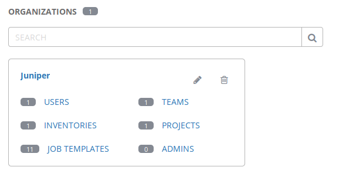    
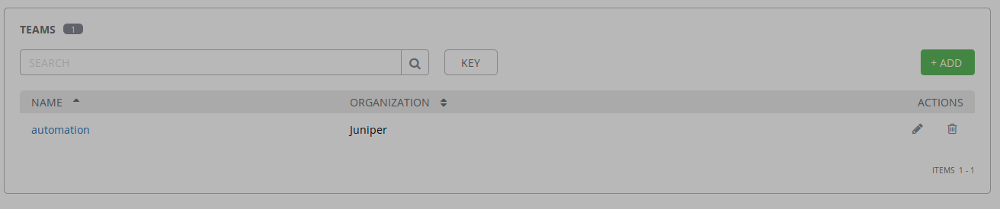  
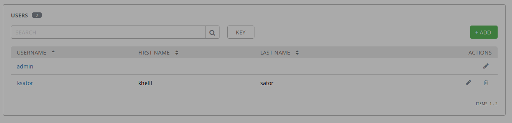   
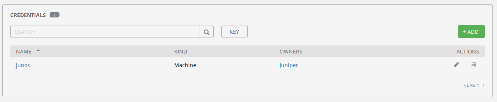   
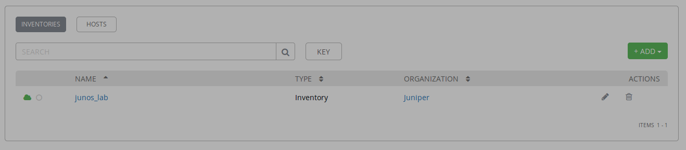    
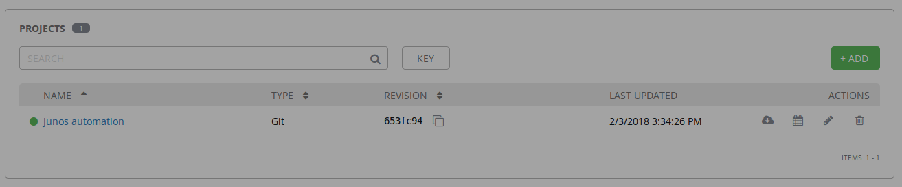   
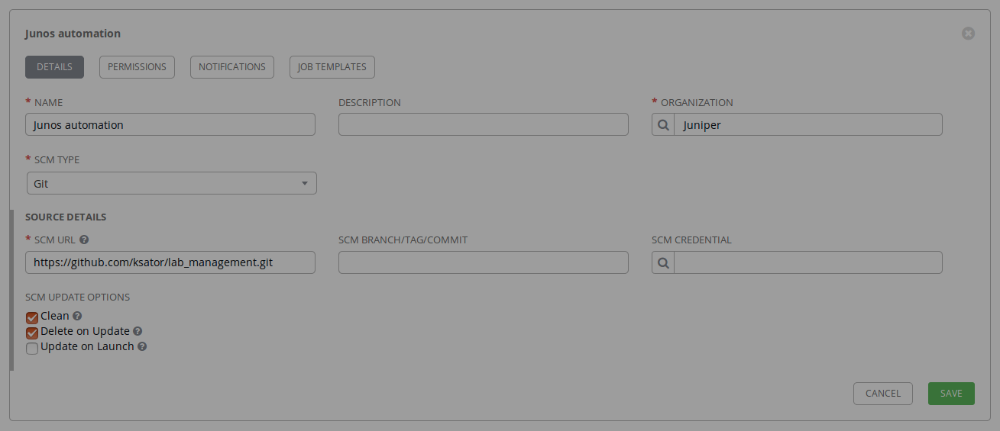    
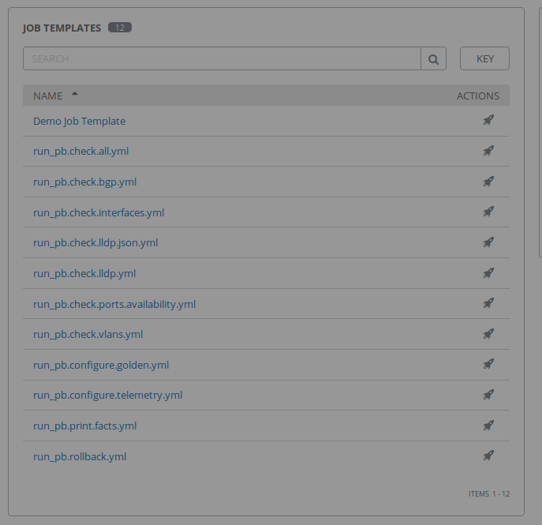   
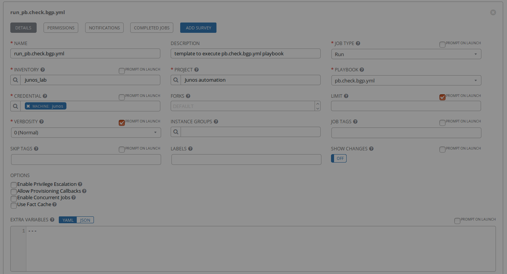    

## Consume AWX templates with automation

The python script ```run_awx_templates.py``` makes REST calls to AWX to run an existing awx template.  
Pass the template name as an argument.   
Run this command on your laptop to consume an existing awx template:  
```
# python run_awx_template.py run_pb.check.bgp.yml
waiting for the job to complete ... 
still waiting for the job to complete ...
still waiting for the job to complete ...
still waiting for the job to complete ...
status is successful
```
```
# python run_awx_template.py run_pb.check.lldp.yml
waiting for the job to complete ... 
still waiting for the job to complete ...
still waiting for the job to complete ...
still waiting for the job to complete ...
still waiting for the job to complete ...
still waiting for the job to complete ...
status is successful
```
```
# python run_awx_templates.py non_existing_awx_template_name
there is a problem with that template
```

Verify with the GUI  
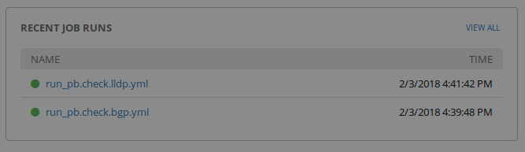  
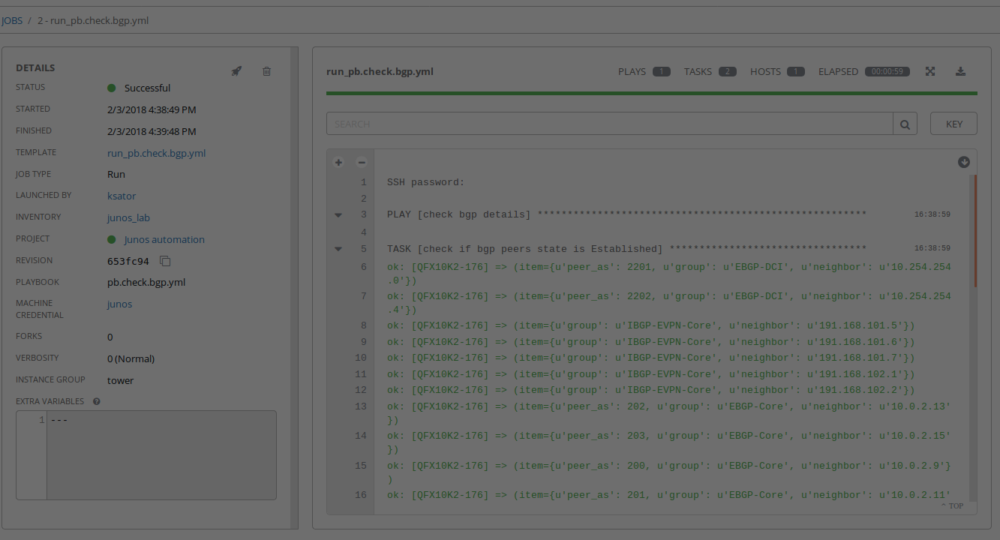   
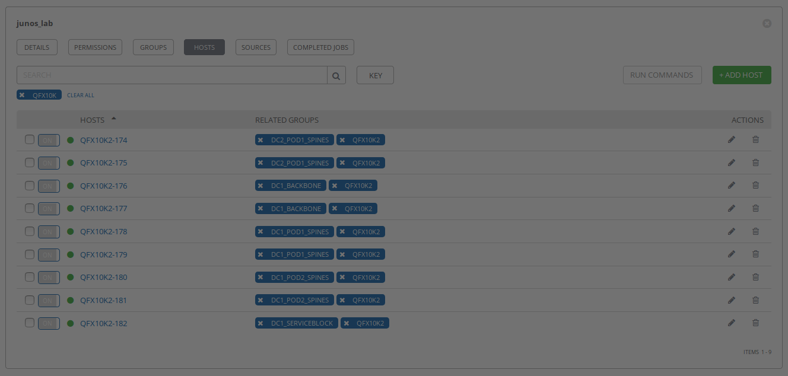  


## Delete AWX templates with automation
Run this command on your laptop to delete all AWX templates:  
```
# python delete_awx_templates.py 
```

Note: By default, AWX database is lost with reboots. You can change this behavior when you install AWX if you prefer AWX to keep its database after system restarts.  

## AWX CLI

#### Install the CLI
```
# pip install ansible-tower-cli
```
#### Get the CLI configuration

```
# tower-cli config

# Defaults.
username: 
use_token: False
verbose: False
certificate: 
format: human
color: True
host: 127.0.0.1
description_on: False
verify_ssl: True
password: 
```
#### Configure the CLI

```
# tower-cli config username admin
Configuration updated successfully.
```
```
# tower-cli config password password
Configuration updated successfully.
```
```
# tower-cli config host http://localhost:80
Configuration updated successfully.
```
```
# tower-cli config verify_ssl false
Configuration updated successfully.
```

```
# tower-cli config

# User options (set with `tower-cli config`; stored in ~/.tower_cli.cfg).
username: admin
password: password
host: http://localhost:80
verify_ssl: False

# Defaults.
use_token: False
verbose: False
certificate: 
format: human
color: True
description_on: False
```
#### Use the CLI

```
# tower-cli credential list
== =============== =============== 
id      name       credential_type 
== =============== =============== 
 1 Demo Credential               1
== =============== =============== 
```
```
# tower-cli organization list
== ======= 
id  name   
== ======= 
 1 Default
 2 Juniper
== ======= 
```
```
# tower-cli organization --help
Usage: tower-cli organization [OPTIONS] COMMAND [ARGS]...

  Manage organizations within Ansible Tower.

Options:
  --help  Show this message and exit.

Commands:
  associate           Associate a user with this organization.
  associate_admin     Associate an admin with this organization.
  associate_ig        Associate an ig with this organization.
  copy                Copy an organization.
  create              Create an organization.
  delete              Remove the given organization.
  disassociate        Disassociate a user with this organization.
  disassociate_admin  Disassociate an admin with this organization.
  disassociate_ig     Disassociate an ig with this organization.
  get                 Return one and exactly one organization.
  list                Return a list of organizations.
  modify              Modify an already existing organization.
```
```
# tower-cli organization delete --help
Usage: tower-cli organization delete [OPTIONS] [ID]

  Remove the given organization.

  If --fail-on-missing is True, then the organization's not being found is
  considered a failure; otherwise, a success with no change is reported.

Field Options:
  -n, --name TEXT         [REQUIRED] The name field.
  -d, --description TEXT  The description field.

Global Options:
  --use-token                     Turn on Tower's token-based authentication.
                                  Set config use_token to make this permanent.
  --certificate TEXT              Path to a custom certificate file that will
                                  be used throughout the command. Overwritten
                                  by --insecure flag if set.
  --insecure                      Turn off insecure connection warnings. Set
                                  config verify_ssl to make this permanent.
  --description-on                Show description in human-formatted output.
  -v, --verbose                   Show information about requests being made.
  -f, --format [human|json|yaml|id]
                                  Output format. The "human" format is
                                  intended for humans reading output on the
                                  CLI; the "json" and "yaml" formats provide
                                  more data, and "id" echos the object id
                                  only.
  -p, --tower-password TEXT       Password to use to authenticate to Ansible
                                  Tower. This will take precedence over a
                                  password provided to `tower config`, if any.
  -u, --tower-username TEXT       Username to use to authenticate to Ansible
                                  Tower. This will take precedence over a
                                  username provided to `tower config`, if any.
  -h, --tower-host TEXT           The location of the Ansible Tower host.
                                  HTTPS is assumed as the protocol unless
                                  "http://" is explicitly provided. This will
                                  take precedence over a host provided to
                                  `tower config`, if any.

Other Options:
  --help  Show this message and exit.
```


## Continuous integration with Travis CI

There is a github webhook with [**Travis CI**](https://travis-ci.org/ksator/junos-automation-with-AWX/)  
The syntax of the python scripts in this repository is tested automatically by Travis CI.  
The files [**.travis.yml**](.travis.yml) at the root of this repository are used for this.  

Here's the last build status [](https://travis-ci.org/ksator/junos-automation-with-AWX) 


## Looking for more automation solutions

https://github.com/ksator?tab=repositories  
https://gitlab.com/users/ksator/projects  
https://gist.github.com/ksator/  

